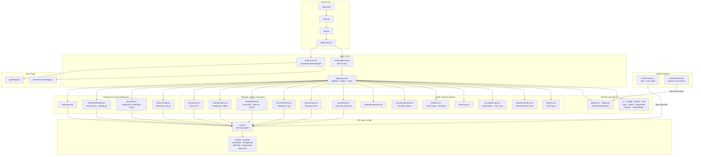

# 🚀 AtomQuest 1.0 — Goal Setting & Tracking Portal

[
[
[
[
[
[

AtomQuest is a premium, enterprise-grade **In-House Goal Setting & Tracking Portal** designed for **Atomberg**. It delivers three fully isolated user journeys — Employee, L1 Manager, and Admin/HR — covering goal sheet creation, compliance enforcement, quarterly check-in logging, visual performance dashboards, and real-time escalation alerts. Every BRD requirement, including all bonus features, has been implemented.

> **Hackathon:** Atomberg Hackathon 1.0 | **Frontend:** React 19 + Tailwind v4 + Vite 8

***

## 📁 Repository Structure

```
atomquest-frontend/
├── index.html                        # Vite entry point
├── vite.config.js                    # Vite + React + Tailwind plugin config
├── tailwind.config.js                # Custom theme, colors, animations
├── eslint.config.js
└── src/
    ├── main.jsx                      # React DOM root mount
    ├── App.jsx                       # App shell — mounts AppRoutes
    ├── App.css / index.css           # Global styles
    │
    ├── api/                          # Axios API layer (per domain)
    │   ├── axios.js                  # Configured Axios instance w/ JWT interceptor
    │   ├── authApi.js                # login, logout
    │   ├── goalsApi.js               # create, fetch, submit goal sheets
    │   ├── checkinApi.js             # quarterly check-in submission
    │   ├── managerApi.js             # team sheets, review, shared goals
    │   ├── adminApi.js               # cycles, users, escalation rules
    │   ├── analyticsApi.js           # dashboard KPIs, heatmap data
    │   └── reportsApi.js             # CSV report export
    │
    ├── context/
    │   ├── AuthContext.jsx           # JWT token + user state (React Context)
    │   └── SocketContext.jsx         # Socket.io connection lifecycle manager
    │
    ├── hooks/
    │   └── useSocket.js              # Custom hook — event subscription + cleanup
    │
    ├── layouts/
    │   ├── AppLayout.jsx             # Authenticated shell: Sidebar + Topbar + Outlet
    │   ├── AuthLayout.jsx            # Unauthenticated wrapper (login, reset)
    │   └── ProtectedRoute.jsx        # Role-based route guard (EMPLOYEE / MANAGER / ADMIN)
    │
    ├── routes/
    │   └── AppRoutes.jsx             # Full SPA route map (all 22 routes)
    │
    ├── components/
    │   ├── Sidebar.jsx               # Role-aware collapsible navigation
    │   ├── Topbar.jsx                # Global header: notifications, profile, socket alerts
    │   ├── GoalDetailsModal.jsx      # Reusable goal detail overlay
    │   └── ui/                       # Atomic design system
    │       ├── Badge.jsx
    │       ├── Button.jsx
    │       ├── Card.jsx
    │       ├── Input.jsx
    │       ├── InputField.jsx
    │       ├── Modal.jsx
    │       ├── ProgressBar.jsx
    │       ├── Spinner.jsx
    │       └── SubmitButton.jsx
    │
    ├── utils/
    │   └── progressScore.js          # BRD UoM score calculator (Min/Max/Timeline/Zero)
    │
    └── pages/
        ├── auth/
        │   ├── LoginPage.jsx         # Email/password login with role detection
        │   └── ResetPasswordPage.jsx # Password reset flow
        │
        ├── ProfilePage.jsx           # Shared across all roles
        │
        ├── employee/
        │   ├── Dashboard.jsx         # Goal summary, cycle status, progress cards
        │   ├── GoalSheetBuilder.jsx  # Interactive goal creation (Thrust Areas, validations)
        │   ├── MyGoals.jsx           # View submitted/approved goals with progress
        │   └── CheckinPage.jsx       # Quarterly planned vs. actual submission
        │
        ├── manager/
        │   ├── Dashboard.jsx         # Team overview, pending approvals, KPIs
        │   ├── TeamSheets.jsx        # List of all team goal sheets by status
        │   ├── SheetReview.jsx       # Inline edit + approve/return goal sheets
        │   ├── CheckinReview.jsx     # Review team check-ins, add feedback
        │   ├── SharedGoals.jsx       # Broadcast shared KPIs to team members
        │   └── TeamMembers.jsx       # Detailed employee profiles + goal progress
        │
        └── admin/
            ├── Dashboard.jsx         # Organisation-wide KPI summary
            ├── UsersManagement.jsx   # Create/manage employees and managers
            ├── CycleManagement.jsx   # Goal cycle configuration + window unlocks
            ├── GoalSheetsAdmin.jsx   # Global view of all goal sheets + exception overrides
            ├── Analytics.jsx         # QoQ SVG line graph + dept heatmap + redlines
            ├── AuditLogs.jsx         # Full immutable action history with filters
            ├── EscalationLogs.jsx    # Escalation rule builder + cron log viewer
            └── Reports.jsx           # CSV export of achievements and audit trails
```

***

## 🏗️ Frontend Architecture

> This diagram is rendered automatically by GitHub using **Mermaid** — plain text that GitHub converts into a live visual flowchart. No image files needed.



***

## 🔑 Hackathon Sandbox Credentials

All accounts share the password **`password123`** and are seeded in the live Neon Postgres database.

| Name | Role | Department | Email | Org Context |
| :--- | :--- | :--- | :--- | :--- |
| **Admin HR** | `ADMIN` | HR | `admin@atomberg.com` | Master config, exception unlocks, global audit trails |
| **Rajesh Kumar** | `MANAGER` | Sales | `rajesh@atomberg.com` | L1 Manager — manages Priya Sharma & Manoj Gaur |
| **Priya Sharma** | `EMPLOYEE` | Sales | `priya@atomberg.com` | Reports to Rajesh Kumar |
| **Manoj Gaur** | `EMPLOYEE` | Engineering | `manoj@atomberg.com` | Reports to Rajesh Kumar |
| **Aarav Mehta** | `MANAGER` | Engineering | `aarav@atomberg.com` | L1 Manager for Engineering |
| **Nisha Rao** | `MANAGER` | Sales | `nisha@atomberg.com` | L1 Manager for Sales |

***

## ⚡ Feature Implementation

### Phase 1 — Goal Creation & Approval

**`GoalSheetBuilder.jsx`** — The core goal authoring interface. Employees select from predefined Thrust Areas (e.g. Sales Revenue, Operational Excellence, TAT Reduction), set a title, description, UoM type, and target value. The form enforces three hard rules before allowing submission:
- Total weightage across all goals must equal exactly **100%**
- Minimum weightage per individual goal is **10%**
- A maximum of **8 goals** can exist per cycle

**`SheetReview.jsx`** — L1 Managers receive submitted sheets here. Goals are editable inline (targets, weightages). The manager can either approve the sheet — which immediately **locks** it from further modification — or return it with a reason, which dispatches an email notification and socket alert to the employee.

**`SharedGoals.jsx`** — Managers can broadcast departmental KPIs to multiple employees at once. The title and target fields on shared goals are read-only for recipients; only weightage is adjustable. Achievement updates on shared goals propagate automatically to all linked employee sheets.

**`MyGoals.jsx`** — Employees track their complete goal history. Displays submission status, manager approval state, and computed progress scores per goal with colour-coded indicators.

***

### Phase 2 — Quarterly Check-ins & Achievement Tracking

**`CheckinPage.jsx`** — Employees log quarterly progress by entering planned vs. actual values for each approved goal. Status can be set to **Not Started**, **On Track**, or **Completed**. Submissions are only permitted within the active check-in window enforced by cycle configuration.

**`progressScore.js`** — A shared utility that computes normalized progress scores according to BRD Unit-of-Measure rules:

| UoM Type | Formula | Use Case |
| :--- | :--- | :--- |
| `MIN` (Higher is Better) | `Achievement ÷ Target` | Revenue, units sold |
| `MAX` (Lower is Better) | `Target ÷ Achievement` | Defect count, TAT |
| `TIMELINE` (Date-based) | Deadline compliance delta | Project milestones |
| `ZERO_BASED` (Zero = Success) | `100%` if actual = 0, else `0%` | Error rate, complaints |

**`CheckinReview.jsx`** — Managers review planned vs. actual achievements for each team member side-by-side and attach structured feedback comments. Every comment fires a real-time socket notification to the employee.

***

### Bonus Features

#### 📧 Real-Time Notifications — `SocketContext.jsx` + `useSocket.js`

`SocketContext.jsx` manages the full Socket.io client lifecycle: connects on login (passing the JWT for server-side auth), disconnects on logout, and exposes the socket instance via context. The `useSocket.js` custom hook wraps event subscriptions with automatic cleanup on unmount, preventing listener leaks. `Topbar.jsx` consumes this hook to render live notification banners for events like sheet approvals, check-in comments, and escalation triggers.

#### 🚨 Escalation Engine — `EscalationLogs.jsx`

Admins configure escalation rules with custom thresholds (e.g. *"Goal sheet not submitted after N days"*, *"Manager has not reviewed check-in after N days"*). The frontend displays a full log of triggered escalations with employee name, rule type, overdue count, and timestamp. Each escalation also fires an automated skip-level email via the backend's `node-cron` runner.

#### 📊 Analytics Dashboard — `Analytics.jsx`

The most feature-rich page in the portal. Contains:
- **Live KPI Cards** — average achievement %, active goal count, pending submissions
- **Manager Performance Redlines** — lowest-performing employee, most delayed objective, average approval time, check-in completion rate
- **SVG Line Graph** — Quarter-on-Quarter (QoQ) performance trends rendered with `recharts`
- **Dynamic Heatmap** — Category × Department distribution matrix visualising where organisational effort is concentrated

#### 📋 Audit Logs — `AuditLogs.jsx`

A complete, immutable action history with search and filter support. Every state-changing event (goal submission, approval, return, check-in, escalation, admin override) is logged with actor, target, action type, and timestamp. Exportable to CSV via `reportsApi.js`.

#### 👥 User & Cycle Management — `UsersManagement.jsx` + `CycleManagement.jsx`

Admins can create and manage employee/manager accounts, assign reporting lines, and configure goal cycle windows. `CycleManagement.jsx` allows unlocking or extending specific check-in windows and granting individual exceptions without disrupting the global cycle.

***

## 🛣️ Route Map

| Path | Component | Role |
| :--- | :--- | :--- |
| `/login` | `LoginPage` | Public |
| `/reset-password` | `ResetPasswordPage` | Public |
| `/dashboard` | `employee/Dashboard` | EMPLOYEE |
| `/my-goals` | `MyGoals` | EMPLOYEE |
| `/goal-builder` | `GoalSheetBuilder` | EMPLOYEE |
| `/checkin` | `CheckinPage` | EMPLOYEE |
| `/manager/dashboard` | `manager/Dashboard` | MANAGER |
| `/manager/team-members` | `TeamMembers` | MANAGER |
| `/manager/review/:sheetId` | `SheetReview` | MANAGER |
| `/manager/checkin/:sheetId` | `CheckinReview` | MANAGER |
| `/manager/shared-goals` | `SharedGoals` | MANAGER |
| `/admin/dashboard` | `admin/Dashboard` | ADMIN |
| `/admin/users` | `UsersManagement` | ADMIN |
| `/admin/cycles` | `CycleManagement` | ADMIN |
| `/admin/goal-sheets` | `GoalSheetsAdmin` | ADMIN |
| `/admin/analytics` | `Analytics` | ADMIN |
| `/admin/audit` | `AuditLogs` | ADMIN |
| `/admin/escalations` | `EscalationLogs` | ADMIN |
| `/admin/reports` | `Reports` | ADMIN |
| `/profile` | `ProfilePage` | ALL |

Unmatched routes and `/` redirect to `/login` via `<Navigate replace />`.

***

## 🧰 Tech Stack

| Category | Library | Version |
| :--- | :--- | :--- |
| UI Framework | React | 19.2 |
| Build Tool | Vite | 8.0 |
| Styling | Tailwind CSS | 4.3 |
| Routing | React Router DOM | 7.15 |
| HTTP Client | Axios | 1.16 |
| Real-time | Socket.io Client | 4.8 |
| Forms | React Hook Form + Zod | 7.76 / 4.4 |
| Charts | Recharts | 3.8 |
| Date Utilities | date-fns | 4.1 |
| Icons | Lucide React | 1.16 |
| Notifications | React Hot Toast | 2.6 |
| Styling Utilities | clsx + tailwind-merge | 2.1 / 3.6 |

***

## 🚀 Local Setup

### Prerequisites
- Node.js ≥ 18
- The backend (`atomquest-backend`) running on port `3000`

### 1. Clone & Install

```bash
git clone https://github.com/Samarth-254/AtomQuest-Frontend.git
cd AtomQuest-Frontend
npm install
```

### 2. Configure Environment

Create `.env` in the project root:

```env
VITE_API_BASE_URL=http://localhost:5000/api
```

### 3. Start Dev Server

```bash
npm run dev
# → http://localhost:5173
```

### 4. Production Build

```bash
npm run build
npm run preview
```

***

## 📧 Email Notification Testing

The sandbox emails (`admin@atomberg.com`, `priya@atomberg.com`, etc.) are corporate-mocked and cannot receive physical delivery. Email dispatch is **100% production-ready** via Brevo SMTP — confirmed by real inbox delivery shown below.

| Trigger | Email Preview |
|---|---|
| 📋 Goal sheet submitted → manager notified |  |
| ✅ Goal sheet approved → employee notified |  |
| 🔄 Goal sheet returned → employee notified | — *(return email sent; screenshot in escalation logs)* |
| 🔓 Modification approved → employee notified |  |
| 💬 Check-in comment added → employee notified |  |
| 📝 Check-in submitted → manager notified |  |

***

## 🏆 Quality Highlights

- **Atomic UI Library** — 9 custom reusable primitives (`Badge`, `Button`, `Card`, `Input`, `InputField`, `Modal`, `ProgressBar`, `Spinner`, `SubmitButton`) keep the design consistent across all 22 routes
- **Role-Based Route Guards** — `ProtectedRoute.jsx` rejects navigation at the React Router level before any component mounts, preventing unauthorized page access entirely
- **Separation of API Concerns** — 8 domain-scoped API modules (`authApi`, `goalsApi`, `checkinApi`, `managerApi`, `adminApi`, `analyticsApi`, `reportsApi`, `axios`) with a single Axios instance handling JWT injection via request interceptors
- **Zero State Leaks** — `useSocket.js` registers event listeners with `useEffect` cleanup, ensuring subscriptions are torn down when components unmount
- **Client-Side CSV Exports** — Achievement lists and audit trails export directly from the browser, conserving backend resources
- **Form Validation** — React Hook Form + Zod schemas enforce type-safe input constraints before any API call is made

***

*Built for Atomberg Hackathon 1.0 — by **Samarth Nagpal**.*

***
